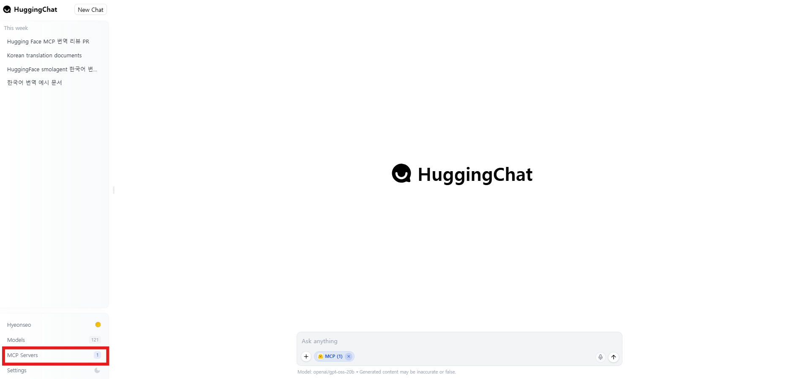
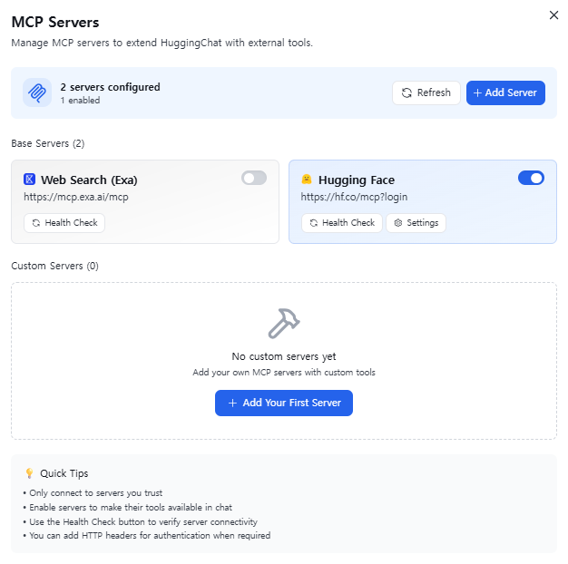
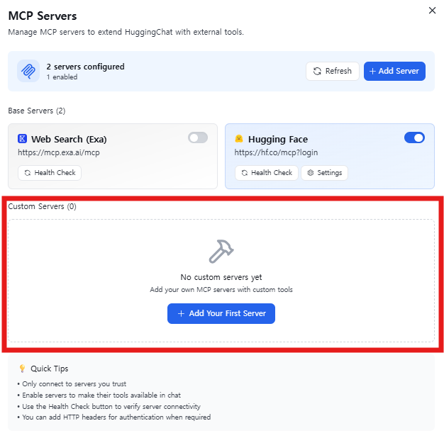
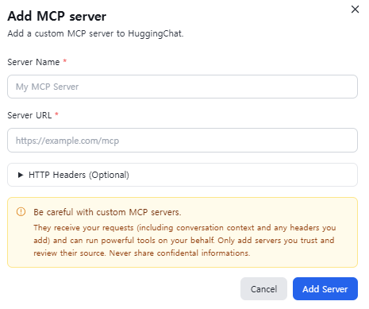
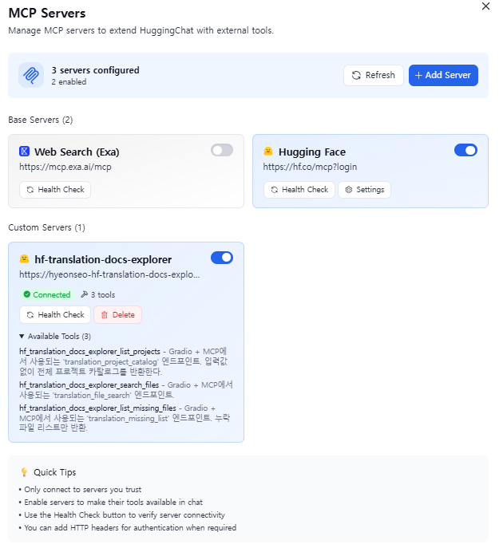
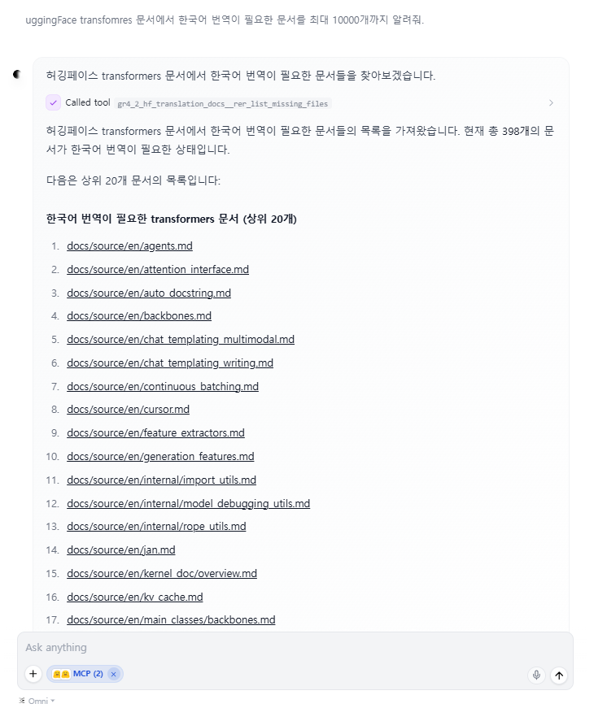
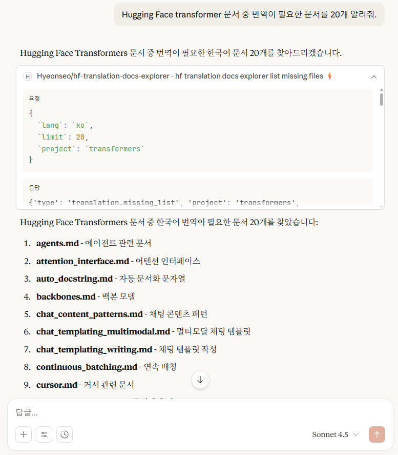

* TOC
{:toc}
<!--toc-->

# 1. 개요
이 문서는 HuggingFace Space에 배포된 Gradio 기반 MCP(Model Context Protocol) 서버를 다양한 클라이언트 환경에서 사용하는 방법을 설명하고 있습니다. 

# 2.  HuggingFace 번역 MCP 서버 아키텍처
## 2-1. HuggingFace Space + Gradio MCP 구성
본 번역 MCP 서버는 HuggingFace Space 상에서 Gradio 애플리케이션으로 실행되며,
Gradio가 제공하는 MCP 엔드포인트를 통해 외부 클라이언트와 통신합니다.

## 2-2. MCP 서버 간 역할 분리 구조
- 번역 허브는 단일 MCP 서버가 아닌, 기능 단위로 분리된 MCP 서버 집합으로 구성되어 있습니다.

| MCP 서버    | 역할                              |
| --------- | ------------------------------- |
| 문서 검색 MCP | GitHub 저장소의 문서 목록 조회 및 파일 내용 수집 |
| 번역 MCP    | 원문 문서를 기반으로 번역 수행               |
| PR 등록 MCP | 번역 결과를 GitHub PR로 생성            |
| PR 리뷰 MCP | 번역 품질 검토 및 리뷰 코멘트 생성            |

이 구조를 통해 다음과 같은 장점이 있습니다.
- MCP 서버 간 책임 분리
- 클라이언트에서 필요한 MCP만 선택 사용 가능
- n8n, CLI 환경에서 파이프라인 구성 용이

# 3. 사전 준비 사항

## 3-1. MCP 서버 URL 확인
HuggingFace Space에 배포된 MCP 서버의 기본 URL 형식은 다음과 같습니다.
```
https://<space-name>.hf.space/gradio_api/mcp
```

Tool schema는 아래와 같이 확인할 수 있습니다.
```
curl https://<space-name>.hf.space/gradio_api/mcp/schema
```

## 3-2. Public / Private Space 차이
- Public Space
    - 별도 인증 없이 접근 가능
- Private Space
    - Authorization: Bearer <HF_TOKEN> 헤더 필요
    - 클라이언트별 헤더 설정 지원 여부 상이

# 4. HuggingChat
- [HuggingChat](https://huggingface.co/chat/)




## 4-1. HuggingFace MCP 서버 기반 등록
Hugging Face McP 서버를 활용하는 방법으로 [Hugging Face MCP Course](https://huggingface.co/learn/mcp-course/unit1/hf-mcp-server) 게시글 참고하여 등록할 수 있습니다. 

## 4-2. Custom 서버 등록
HuggingChat에서 MCP 서버를 추가합니다.




1. Settings → MCP Servers → Add MCP Server
2. Server URL: https://<space-name>.hf.space/gradio_api/mcp





# 5. HuggingFace MCP 서버 공통 등록 및 멀티 클라이언트 사용
HuggingFace MCP 서버에 한 번 등록해 두면, 여러 클라이언트 및 개발 환경에서 동일한 MCP 서버를 재사용할 수 있습니다.
* 참고자료 : [Hugging Face MCP Course](https://huggingface.co/learn/mcp-course/unit1/hf-mcp-server)

HuggingFace에서는 MCP 서버를 기준으로 다음과 같은 환경에서의 사용을 지원합니다.
- Claude Desktop / claude.ai
- Claude Code
- Gemini CLI
- VSCode
- Cursor

각 클라이언트에 대한 적용 방법은 [Hugging Face MCP 서버 Github 저장소](https://github.com/huggingface/hf-mcp-server)를 참고하여 사용할 수 있습니다. 




# 6. CLI
## 6-1. Tool 목록 확인
```
curl -N -X POST \
  "https://<space-name>.hf.space/gradio_api/mcp/" \
  -H "Content-Type: application/json" \
  -H "Accept: application/json, text/event-stream" \
  -d '{
    "jsonrpc":"2.0",
    "id":"tools-1",
    "method":"tools/list",
    "params":{}
  }'
```
- 예시
```
$ curl -N -X POST   "https://hyeonseo-hf-translation-docs-explorer.hf.space/gradio_api/mcp/"   -H "Content-Type: application/json"   -H "Accept: application/json, text/event-stream"   -d '{
    "jsonrpc":"2.0",
    "id":"tools-1",
    "method":"tools/list",
    "params":{}
  }'
event: message
data: {"jsonrpc":"2.0","id":"tools-1","result":{"tools":[{"name":"hf_translation_docs_explorer_list_projects","description":"Gradio + MCP에서 사용되는 'translation_project_catalog' 엔드포인트. 입력값 없이 전체 프로젝트 카탈로그를 반환한다.","inputSchema":{"type":"object","properties":{}}},{"name":"hf_translation_docs_explorer_search_files","description":"Gradio + MCP에서 사용되는 'translation_file_search' 엔드포인트.","inputSchema":{"type":"object","properties":{"project":{"type":"string","enum":["smolagents","transformers"],"description":"","default":"smolagents"},"lang":{"type":"string","enum":["ko","ja","zh","fr","de"],"description":"","default":"ko"},"limit":{"type":"number","description":"","default":5},"include_status_report":{"type":"boolean","description":"","default":true}}}},{"name":"hf_translation_docs_explorer_list_missing_files","description":"Gradio + MCP에서 사용되는 'translation_missing_list' 엔드포인트. 누락 파일 리스트만 반환.","inputSchema":{"type":"object","properties":{"project":{"type":"string","enum":["smolagents","transformers"],"description":"","default":"smolagents"},"lang":{"type":"string","enum":["ko","ja","zh","fr","de"],"description":"","default":"ko"},"limit":{"type":"number","description":"","default":20}}}}]}}
```

## 6-2. Tool 호출 (Streaming)
```
curl -N \
  -X POST \
  https://<space-name>.hf.space/gradio_api/mcp/ \
  -H "Content-Type: application/json" \
  -H "Accept: application/json, text/event-stream" \
  -d '{
    "jsonrpc":"2.0",
    "id":"call-1",
    "method":"call_tool",
    "params":{
      "name":"tool_name",
      "arguments":{}
    }
  }'
```
- 예시
```
$ curl -N -X POST   "https://hyeonseo-hf-translation-docs-explorer.hf.space/gradio_api/mcp/"   -H "Content-Type: application/json"   -H "Accept: application/json, text/event-stream"   -d '{
    "jsonrpc":"2.0",
    "id":"call-2",
    "method":"tools/call",
    "params":{
      "name":"hf_translation_docs_explorer_search_files",
      "arguments":{
        "project":"transformers", 
        "lang":"ko",
        "limit":5,
        "include_status_report":false 
      }
    }
  }'
event: message
data: {"jsonrpc":"2.0","id":"call-2","result":{"content":[{"type":"text","text":"{'type': 'translation.search.response', 'request': {'type': 'translation.search.request', 'project': 'transformers', 'target_language': 'ko', 'limit': 5, 'include_status_report': False}, 'files': [{'rank': 1, 'path': 'docs/source/en/agents.md', 'repo_url': 'https://github.com/huggingface/transformers/blob/main/docs/source/en/agents.md', 'metadata': {'project': 'transformers', 'target_language': 'ko', 'docs_path': 'docs/source'}}, {'rank': 2, 'path': 'docs/source/en/attention_interface.md', 'repo_url': 'https://github.com/huggingface/transformers/blob/main/docs/source/en/attention_interface.md', 'metadata': {'project': 'transformers', 'target_language': 'ko', 'docs_path': 'docs/source'}}, {'rank': 3, 'path': 'docs/source/en/auto_docstring.md', 'repo_url': 'https://github.com/huggingface/transformers/blob/main/docs/source/en/auto_docstring.md', 'metadata': {'project': 'transformers', 'target_language': 'ko', 'docs_path': 'docs/source'}}, {'rank': 4, 'path': 'docs/source/en/backbones.md', 'repo_url': 'https://github.com/huggingface/transformers/blob/main/docs/source/en/backbones.md', 'metadata': {'project': 'transformers', 'target_language': 'ko', 'docs_path': 'docs/source'}}, {'rank': 5, 'path': 'docs/source/en/chat_content_patterns.md', 'repo_url': 'https://github.com/huggingface/transformers/blob/main/docs/source/en/chat_content_patterns.md', 'metadata': {'project': 'transformers', 'target_language': 'ko', 'docs_path': 'docs/source'}}], 'total_candidates': 5, 'status_report': None}"}],"isError":false}}
```


